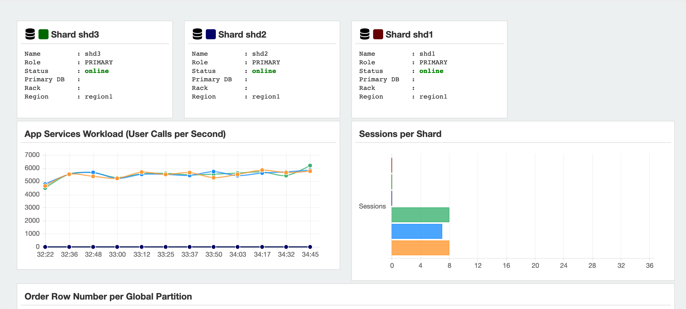
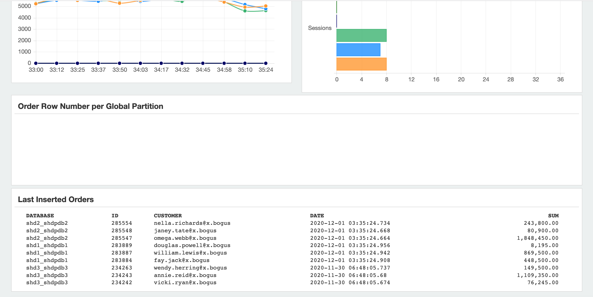

# Elastic Scaling

## Introduction

In this lab, we will add the shard (on shd3) to the Shard Database and thus elastically scale the SDB. Make sure you have done all steps in the shard3 host according to the lab 2 "Shard Database Deployment" to configure the shard host and setup shard database.

Estimated Lab Time: 20 minutes.

### Objectives

In this lab, you will perform the following steps:
- Add the New Shard
- Deploy and Verify the New Shard
- Run the custom data loading again on 3 sharded database

### Prerequisites

This lab assumes you have already completed the following:
- Sharded database deployment
- Create demo app schema
- Custom data loading

## **Step 1:** Add the New Shard

1. Connect to the catalog database host. Switch to oracle user.

   ```
   $ ssh -i labkey opc@152.67.196.50
   Last login: Tue Dec  1 01:01:30 2020 from 202.45.129.206
   -bash: warning: setlocale: LC_CTYPE: cannot change locale (UTF-8): No such file or directory
   [opc@cata ~]$ sudo su - oracle
   Last login: Tue Dec  1 01:01:32 GMT 2020 on pts/0
   [oracle@cata ~]$ 
   ```

   

2. Switch to the GSM environment.

   ```
   [oracle@cata ~]$ . ./gsm.sh
   [oracle@cata ~]$
   ```

   

3. Launch `GDSCTL`.

   ```
   [oracle@cata ~]$ gdsctl
   GDSCTL: Version 19.0.0.0.0 - Production on Tue Dec 01 01:55:50 GMT 2020
   
   Copyright (c) 2011, 2019, Oracle.  All rights reserved.
   
   Welcome to GDSCTL, type "help" for information.
   
   Current GSM is set to SHARDDIRECTOR1
   GDSCTL> 
   ```

   

4. Show current shard configuration.

   ```
   GDSCTL> config shard
   Catalog connection is established
   Name                Shard Group         Status    State       Region    Availability 
   ----                -----------         ------    -----       ------    ------------ 
   shd1_shdpdb1        shardgroup_primary  Ok        Deployed    region1   ONLINE       
   shd2_shdpdb2        shardgroup_primary  Ok        Deployed    region1   ONLINE       
   
   GDSCTL> 
   ```

   

5. Add the third shard CDB.

   ```
   GDSCTL> <copy>add cdb -connect shd3:1521/shd3 -pwd Ora_DB4U</copy>
   DB Unique Name: shd3
   The operation completed successfully
   GDSCTL> 
   ```

   

6. List of current CDBs in the catalog.

   ```
   GDSCTL> <copy>config cdb</copy>
   shd1                          
   shd2                          
   shd3                          
   
   GDSCTL>
   ```

   

7. Add the third shard information to the shard catalog.

   ```
   GDSCTL> <copy>add shard -connect shd3:1521/shdpdb3 -pwd Ora_DB4U -shardgroup shardgroup_primary -cdb shd3</copy>
   INFO: Data Guard shard validation requested.
   INFO: Database role is PRIMARY.
   INFO: Database name is SHD3.
   INFO: Database unique name is shd3.
   INFO: Database ID is 1363280829.
   INFO: Database open mode is READ WRITE.
   INFO: Database in archivelog mode.
   INFO: Flashback is on.
   INFO: Force logging is on.
   INFO: Database platform is Linux x86 64-bit.
   INFO: Database character set is AL32UTF8. This value must match the character set of the catalog database.
   INFO: 'compatible' initialization parameter validated successfully.
   INFO: Database is a multitenant container database.
   INFO: Current container is SHDPDB3.
   INFO: Database is using a server parameter file (spfile).
   INFO: db_create_file_dest set to: '/u01/app/oracle/oradata'
   INFO: db_recovery_file_dest set to: '/u01/app/oracle/fast_recovery_area'
   INFO: db_files=1024. Must be greater than the number of chunks and/or tablespaces to be created in the shard.
   INFO: dg_broker_start set to TRUE.
   INFO: remote_login_passwordfile set to EXCLUSIVE.
   INFO: db_file_name_convert set to: '/SHDSTB3/, /SHD3/'
   INFO: GSMUSER account validated successfully.
   INFO: DATA_PUMP_DIR is '/u01/app/oracle/admin/shd3/dpdump/B550C2996B1F2C04E0530500000A6D1D'.
   DB Unique Name: shd3_shdpdb3
   The operation completed successfully
   GDSCTL> 
   ```

   

8. View the shard metadata on the shard catalog.

   ```
   GDSCTL> <copy>config shard</copy>
   Name                Shard Group         Status    State       Region    Availability 
   ----                -----------         ------    -----       ------    ------------ 
   shd1_shdpdb1        shardgroup_primary  Ok        Deployed    region1   ONLINE       
   shd2_shdpdb2        shardgroup_primary  Ok        Deployed    region1   ONLINE       
   shd3_shdpdb3        shardgroup_primary  U         none        region1   -            
   
   GDSCTL>
   ```

   

9. View a list of trusted hosts.

   ```
   GDSCTL> <copy>config vncr</copy>
   Name                          Group ID                      
   ----                          --------                      
   10.0.0.2                                                    
   10.0.0.3                                                    
   10.0.0.4                                                    
   127.0.0.1                                                   
   cata                                                        
   shd1                                                        
   shd2                                                        
   shd3                                                        
   
   GDSCTL>
   ```

   

10. The host name of shard3 is already there. Manually add shard3 IP addresses to the shard catalog metadata.

    ```
    GDSCTL> add invitednode 10.0.0.5
    GDSCTL>
    ```

    

11. View the list of trusted hosts again.

    ```
    GDSCTL> <copy>config vncr</copy>
    Name                          Group ID                      
    ----                          --------                      
    10.0.0.2                                                    
    10.0.0.3                                                    
    10.0.0.4                                                    
    10.0.0.5                                                    
    127.0.0.1                                                   
    cata                                                        
    shd1                                                        
    shd2                                                        
    shd3                                                        
    
    GDSCTL> 
    ```


## **Step 2:** Deploy and Verify the New Shard.

1. Run the deploy command to add the new shard.

   ```
   GDSCTL> deploy
   deploy: examining configuration...
   deploy: requesting Data Guard configuration on shards via GSM
   deploy: shards configured; background operations in progress
   The operation completed successfully
   GDSCTL> 
   ```

   

2. Observe the newly added shard.

   ```
   GDSCTL> <copy>config shard</copy>
   Name                Shard Group         Status    State       Region    Availability 
   ----                -----------         ------    -----       ------    ------------ 
   shd1_shdpdb1        shardgroup_primary  Ok        Deployed    region1   ONLINE       
   shd2_shdpdb2        shardgroup_primary  Ok        Deployed    region1   ONLINE       
   shd3_shdpdb3        shardgroup_primary  Ok        Deployed    region1   ONLINE       
   
   GDSCTL> 
   ```

   

3. Run the following command every minute or two to see the progress of automatic rebalancing of chunks.

   ```
   GDSCTL> <copy>config chunks -show_reshard</copy>
   Chunks
   ------------------------
   Database                      From      To        
   --------                      ----      --        
   shd1_shdpdb1                  1         5         
   shd2_shdpdb2                  7         12        
   shd3_shdpdb3                  6         6         
   
   Ongoing chunk movement
   ------------------------
   Chunk     Source                        Target                        status    
   -----     ------                        ------                        ------    
   5         shd1_shdpdb1                  shd3_shdpdb3                  scheduled 
   6         shd1_shdpdb1                  shd3_shdpdb3                  Running   
   11        shd2_shdpdb2                  shd3_shdpdb3                  scheduled 
   12        shd2_shdpdb2                  shd3_shdpdb3                  scheduled 
   
   GDSCTL> 
   ```

   

4. Observe that the chunks are automatically rebalanced upon the addition of new shard.

   ```
   GDSCTL> config chunks -show_reshard
   Chunks
   ------------------------
   Database                      From      To        
   --------                      ----      --        
   shd1_shdpdb1                  1         4         
   shd2_shdpdb2                  7         10        
   shd3_shdpdb3                  5         6         
   shd3_shdpdb3                  11        12        
   
   Ongoing chunk movement
   ------------------------
   Chunk     Source                        Target                        status    
   -----     ------                        ------                        ------    
   
   GDSCTL> 
   ```

   

5. Observe that the “databases” are automatically registered.

   ```
   GDSCTL> <copy>databases</copy>
   Database: "shd1_shdpdb1" Registered: Y State: Ok ONS: N. Role: PRIMARY Instances: 1 Region: region1
      Service: "oltp_rw_srvc" Globally started: Y Started: Y
               Scan: N Enabled: Y Preferred: Y
      Registered instances:
        orasdb%1
   Database: "shd2_shdpdb2" Registered: Y State: Ok ONS: N. Role: PRIMARY Instances: 1 Region: region1
      Service: "oltp_rw_srvc" Globally started: Y Started: Y
               Scan: N Enabled: Y Preferred: Y
      Registered instances:
        orasdb%11
   Database: "shd3_shdpdb3" Registered: Y State: Ok ONS: N. Role: PRIMARY Instances: 1 Region: region1
      Service: "oltp_rw_srvc" Globally started: Y Started: Y
               Scan: N Enabled: Y Preferred: Y
      Registered instances:
        orasdb%21
   
   GDSCTL> 
   ```

   

6. Observe that the “services” are automatically brought up on the newly added shard.

   ```
   GDSCTL> <copy>services</copy>
   Service "oltp_rw_srvc.orasdb.oradbcloud" has 3 instance(s). Affinity: ANYWHERE
      Instance "orasdb%1", name: "shd1", db: "shd1_shdpdb1", region: "region1", status: ready.
      Instance "orasdb%11", name: "shd2", db: "shd2_shdpdb2", region: "region1", status: ready.
      Instance "orasdb%21", name: "shd3", db: "shd3_shdpdb3", region: "region1", status: ready.
   
   GDSCTL> 
   ```

   

## **Step 3:** Run the Demo App Again

1. Connect to the catalog host, switch to oracle user, change directory to `sdb_demo_app`.

   ```
   $ ssh -i labkey opc@152.67.196.50
   Last login: Tue Dec  1 01:55:09 2020 from 202.45.129.206
   -bash: warning: setlocale: LC_CTYPE: cannot change locale (UTF-8): No such file or directory
   
   [opc@cata ~]$ sudo su - oracle
   Last login: Tue Dec  1 01:55:17 GMT 2020 on pts/0
   [oracle@cata ~]$ 
   ```

   

2. Login to the sqlplus as sysdba, switch to the pdb.

   ```
   [oracle@cata ~]$ sqlplus / as sysdba
   
   SQL*Plus: Release 19.0.0.0.0 - Production on Tue Dec 1 03:27:17 2020
   Version 19.7.0.0.0
   
   Copyright (c) 1982, 2020, Oracle.  All rights reserved.
   
   
   Connected to:
   Oracle Database 19c Enterprise Edition Release 19.0.0.0.0 - Production
   Version 19.7.0.0.0
   
   SQL> alter session set container=catapdb;
   
   Session altered.
   
   SQL> 
   ```

   

3. Manually update the monitored shard list.

   ```
   SQL> <copy>exec dbms_global_views.create_all_database_links();</copy>
   
   PL/SQL procedure successfully completed.
   
   SQL> exit
   Disconnected from Oracle Database 19c Enterprise Edition Release 19.0.0.0.0 - Production
   Version 19.7.0.0.0
   [oracle@cata ~]$
   ```

   

4. Change the directory to `sdb_demo_app`. Start the workload by executing command: `./run.sh demo`.

   ```
   [oracle@cata ~]$ cd sdb_demo_app
   [oracle@cata sdb_demo_app]$ ./run.sh demo
   ```

   

5. The result likes the following.

   ```
   Performing initial fill of the products table...
   Syncing shards...
    RO Queries | RW Queries | RO Failed  | RW Failed  | APS 
             0            0            0            0            1
             0            0            0            0            0
            85            4            0            0           25
           639          109            0            0          191
          2508          451            0            0          636
          4731          783            0            0          746
          7212         1174            0            0          838
          9763         1543            0            0          871
         12269         1905            0            0          854
         14337         2265            0            0          701
         16250         2657            0            0          652
         18242         3020            0            0          674
         20548         3366            0            0          779
         22710         3697            0            0          742
         24959         4058            0            0          768
         26933         4405            1            0          675
         29219         4818            1            0          775
         31483         5202            1            0          758
         33654         5608            1            0          740
         36274         6092            1            0          891
    RO Queries | RW Queries | RO Failed  | RW Failed  | APS 
         38778         6546            1            0          845
         41267         6934            1            0          836
         43384         7299            1            0          727
         45840         7694            1            0          839
         48209         8066            1            0          820
         50467         8425            1            0          765
   ```

   

6. Open another terminal, connect to the catalog host, switch to oracle user. Change the directory to `sdb_demo_app`.

   ```
   $ ssh -i labkey opc@152.67.196.50
   Last login: Mon Nov 30 06:07:40 2020 from 202.45.129.206
   -bash: warning: setlocale: LC_CTYPE: cannot change locale (UTF-8): No such file or directory
   [opc@cata ~]$ sudo su - oracle
   Last login: Mon Nov 30 06:08:03 GMT 2020 on pts/0
   [oracle@cata ~]$ cd ~/sdb_demo_app
   [oracle@cata sdb_demo_app]$
   ```

   

7. Start the monitoring tool via the following command. 

   ```
   [oracle@cata sdb_demo_app]$ <copy>./run.sh monitor</copy>
   @oracle.monitor.Main.registerDatabase : INFO 2020-12-01T03:30:41.501 : Context : /db/demo/info
   @oracle.monitor.DatabaseMonitor$BackgroundStatusCheck.run : java.lang.ArrayIndexOutOfBoundsException : 3
   @oracle.monitor.DatabaseMonitor$BackgroundStatusCheck.run : java.lang.ArrayIndexOutOfBoundsException : 4
   @oracle.monitor.DatabaseMonitor$BackgroundStatusCheck.run : java.lang.ArrayIndexOutOfBoundsException : 5
   ```

   

8. From you laptop, launch a browser and use the URL: `http://xxx.xxx.xxx.xxx/8081`. Using the public ip address of the catalog host and the port number is 8081.

   

   

9. Scroll down the screen, you can see the Last inserted orders:

   

   

10. Press `Ctrl+C` to cancel the demo in both of the terminal.

