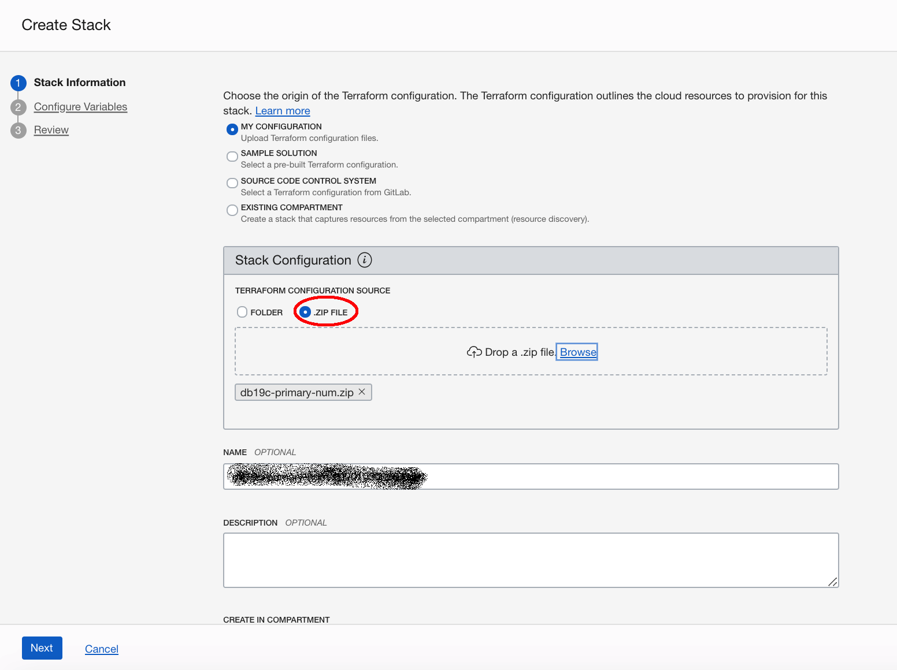
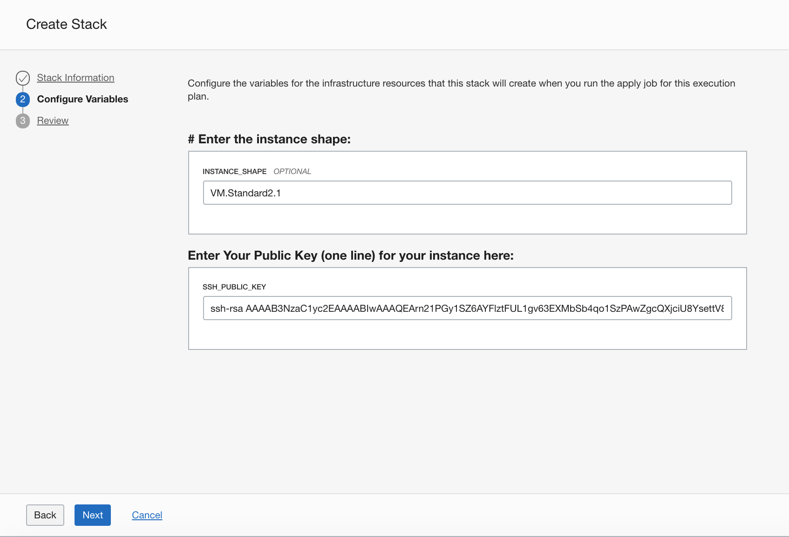
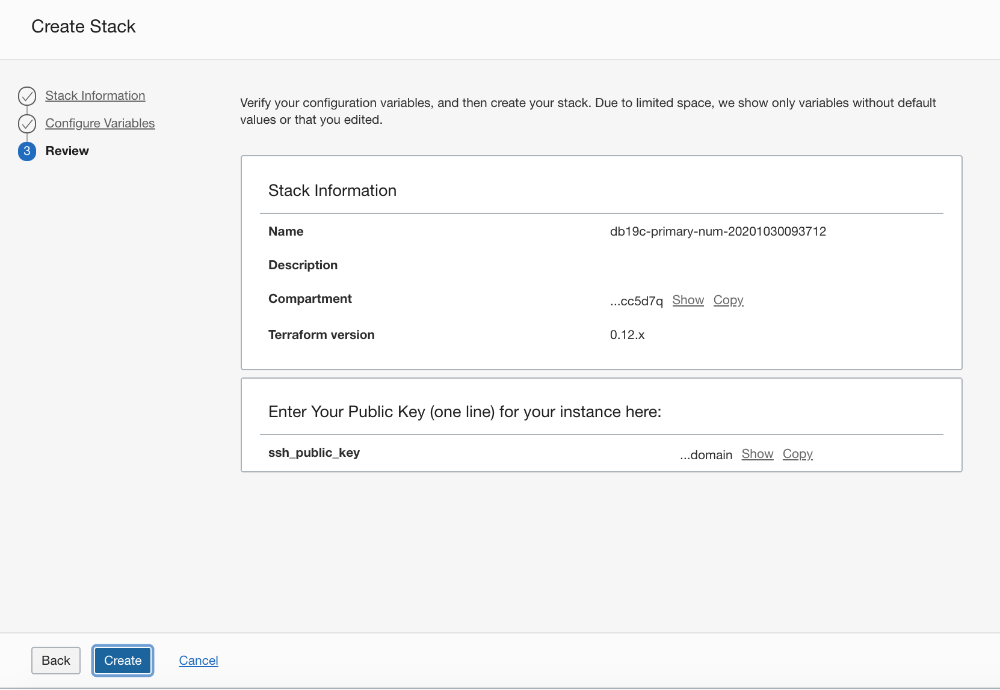
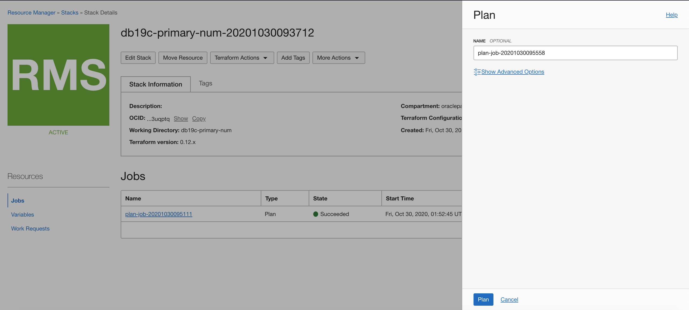
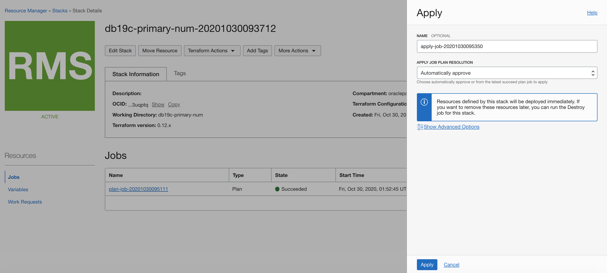
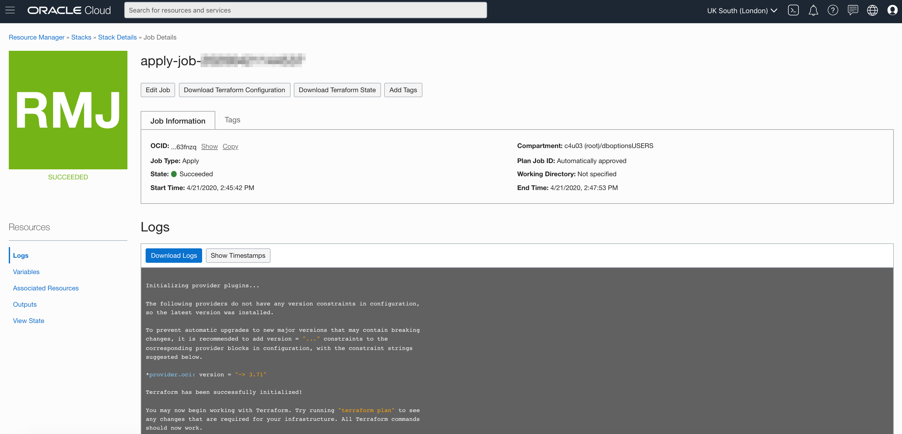
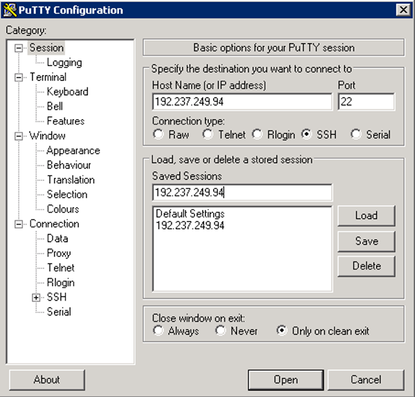

# Provision Catalog and Shard Database

## Introduction

In this lab you will setup 4 compute instances using Oracle Resource Manager and Terraform. The databases are automatically installed in the instances. One will be used as the catalog named cata. Others are used as the shard database name shd1, shd2 and shd3.

Estimated Lab Time: 30 minutes.

### Objectives

-   Use Terraform and Resource Manager to setup the catalog and shard database.

### Prerequisites

This lab assumes you have already completed the following:
- An Oracle Free Tier, Always Free, Paid or LiveLabs Cloud Account
- Create a SSH Keys pair

Click on the link below to download the Resource Manager zip files you need to build your enviornment.

- [sdb19c-primary-num.zip](https://github.com/minqiaowang/on-p) - Packaged terraform primary database instance creation script


## **Step 1:** Prepare the Shard Database

1. Login to the Oracle Cloud Console, open the hamburger menu in the left hand corner. Choose **Resource Manager > Stacks**. Choose the **Compartment** that you want to use, click the  **Create Stack** button. *Note: If you are in a workshop, double check your region to ensure you are on the assigned region.*

    

    

    

    

2. Check the **ZIP FILE**, Click the **Browse** link and select the primary database setup zip file (s`db19c-primary-num.zip`) that you downloaded. Click **Select** to upload the zip file.

    

    Accept all the defaults and click **Next**.


3. Accept the default value of the `Instance_Shape`. Paste the content of the public key you create before to the `SSH_PUBLIC_KEY`,  and click **Next**. 

    

    

4. Click **Create**.

    

5. Your stack has now been created!  Now to create your environment. *Note: If you get an error about an invalid DNS label, go back to your Display Name, please do not enter ANY special characters or spaces. It will fail.*

    

## **Step 2:** Terraform Plan (OPTIONAL)

When using Resource Manager to deploy an environment, execute a terraform **Plan** to verify the configuration. This is an optional step in this lab.

1.  [OPTIONAL] Click **Terraform Actions** -> **Plan** to validate your configuration. Click **Plan**. This takes about a minute, please be patient.

    

    

    

    

## **Step 3:** Terraform Apply

When using Resource Manager to deploy an environment, execute a terraform **Plan** and **Apply**. Let's do that now.

1. At the top of your page, click on **Stack Details**.  Click the button, **Terraform Actions** -> **Apply**. Click **Apply**. This will create your instance and install Oracle 19c. This takes about a minute, please be patient.

    

    

    

    

    

2. Once this job succeeds, you will get an apply complete notification from Terraform.  In the end of the apply log,  you can get the **public ip address** and **private ip address** for each of the instances. Congratulations, your environment is created! Time to login to your instance to finish the configuration.

    

3.  Write down all the public and private ip for later use. It's same like the following.

    ```
    152.67.196.50  10.0.0.2 cata 
    152.67.196.240 10.0.0.3 shd1 
    152.67.199.233 10.0.0.4 shd2 
    152.67.196.227 10.0.0.5 shd3 
    ```

    

## **Step 4:** Connect to your Instance

### MAC or Windows CYGWIN Emulator

1.  Open up a terminal (MAC) or cygwin emulator as the opc user.  Enter yes when prompted.

    ````
    ssh -i ~/.ssh/optionskey opc@<Your Compute Instance Public IP Address>
    ````

2. After successfully logging in, proceed to Step 5.

    ```
    ssh -i labkey opc@xxx.xxx.xxx.xxx
    The authenticity of host 'xxx.xxx.xxx.xxx (xxx.xxx.xxx.xxx)' can't be established.
    ECDSA key fingerprint is SHA256:Wq+YNHzgc1JUySBJuTRO0T4NKpeRz5Udw82Mn5RCe6c.
    Are you sure you want to continue connecting (yes/no/[fingerprint])? yes
    Warning: Permanently added 'xxx.xxx.xxx.xxx' (ECDSA) to the list of known hosts.
    -bash: warning: setlocale: LC_CTYPE: cannot change locale (UTF-8): No such file or directory
    [opc@primary ~]$ 
    ```

    

### Windows using Putty

1.  Open up putty and create a new connection.

2.  Enter a name for the session and click **Save**.

    

3.  Click **Connection** > **Data** in the left navigation pane and set the Auto-login username to root.

4.  Click **Connection** > **SSH** > **Auth** in the left navigation pane and configure the SSH private key to use by clicking Browse under Private key file for authentication.

5.  Navigate to the location where you saved your SSH private key file, select the file, and click Open.  NOTE:  You cannot connect while on VPN or in the Oracle office on clear-corporate (choose clear-internet).

    

6.  The file path for the SSH private key file now displays in the Private key file for authentication field.

7.  Click Session in the left navigation pane, then click Save in the Load, save or delete a stored session Step.

8.  Click Open to begin your session with the instance.

## **Step 5:** Verify the Database is Up

1.  From your connected session of choice **tail** the `buildsingle.log`, This file has the configures log of the database.

    ````
    <copy>
    tail -f /u01/ocidb/buildsingle.log
    </copy>
    ````
    

2.  When you see the following message, the database setup is complete - **Completed successfully in XXXX seconds** (this may take up to 30 minutes). You can do the **Step 6** to setup the standby environment while waiting the primary database ready .

    

3.  Run the following command to verify the database with the SID **ORCL** is up and running.

    ````
    <copy>
    ps -ef | grep ORCL
    </copy>
    ````

    

4. Verify the listener is running:

    ````
    <copy>
    ps -ef | grep tns
    </copy>
    ````

    

5.  Connect to the Database using SQL*Plus as the **oracle** user.

    ````
    <copy>
    sudo su - oracle
    sqlplus system/Ora_DB4U@localhost:1521/orclpdb
    </copy>
    ````
    


    
6.  To leave `sqlplus` you need to use the exit command. Copy and paste the text below into your terminal to exit sqlplus.

    ````
    <copy>
    exit
    </copy>
    ````

7.  Copy and paste the below command to exit from oracle user and become an **opc** user.

    ````
    <copy>
    exit
    </copy>
    ````

You now have a fully functional Oracle Database 19c instance running on Oracle Cloud Compute.

You may proceed to the next lab.

## Acknowledgements
* **Author** - Minqiao Wang, DB Product Management, Dec 2020
* **Contributors** -  
* **Last Updated By/Date** - Minqiao Wang, DB Product Management, Dec 2020
* **Workshop Expiry Date** - Nov 30, 2021

## See an issue?
Please submit feedback using this [form](https://apexapps.oracle.com/pls/apex/f?p=133:1:::::P1_FEEDBACK:1). Please include the *workshop name*, *lab* and *step* in your request.  If you don't see the workshop name listed, please enter it manually. If you would like us to follow up with you, enter your email in the *Feedback Comments* section.

