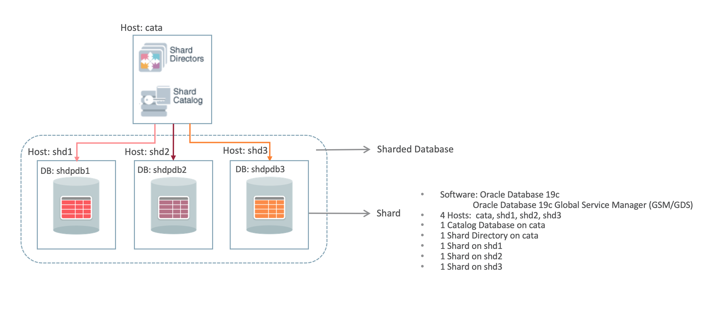

# Oracle Shard Database Deployment

## Introduction

Now, we have 4 database instances. We will use cata as the catalog database, shd1 and shd2 use as the shard database. The shd3 use as the third shard which will be add to the shard database in the last lab.

Here is the topology used for System Managed Sharding:



Estimated Lab Time: 60 minutes.

### Objectives

In this lab, you will deploy shard database with 2 shard.

### Prerequisites

This lab assumes you have already completed the following:
- Setup Environment to provision catalog and shard database.

## **Step 1:** Configure Shard Hosts

1. Connect to the catalog host and each of the shard hosts with opc user. edit the `/etc/hosts` file.

   ```
   $ ssh -i labkey opc@152.67.196.50
   The authenticity of host '152.67.196.50 (152.67.196.50)' can't be established.
   ECDSA key fingerprint is SHA256:pa9pwe2ytZJQPPEJxdCSaR2E0IBtp+jtsVN2qXIbcoI.
   Are you sure you want to continue connecting (yes/no/[fingerprint])? yes
   Warning: Permanently added '152.67.196.50' (ECDSA) to the list of known hosts.
   
   [opc@cata ~]$ sudo vi /etc/hosts
   ```

   

2. Add following lines in the hosts file.

   ```
   10.0.0.2 cata
   10.0.0.3 shd1
   10.0.0.4 shd2
   10.0.0.5 shd3
   ```

   

3. For each of the shard host, open 1521 port.

   ```
   sudo firewall-cmd --add-port=1521/tcp --permanent
   sudo firewall-cmd --reload
   sudo firewall-cmd --list-all
   ```

   

4. For the catalog host, we will install GSM in the same hosts, The default listener port of the shard director is 1522, so we need open 1522 port for gsm host. There is a demo application which need open the 8081 port.

   ```
   sudo firewall-cmd --add-port=1521/tcp --permanent
   sudo firewall-cmd --add-port=1522/tcp --permanent
   sudo firewall-cmd --add-port=8081/tcp --permanent
   sudo firewall-cmd --reload
   sudo firewall-cmd --list-all
   ```

   

## **Step 2:** Install Shard Director Software

In this workshop we choose to co-locate the shard director software on the same host as the shard catalog database, it must be installed in a separate Oracle Home. 

1. Connect to the cata host, switch to the **oracle** user.

   ```
   $ ssh -i labkey opc@152.67.196.50
   The authenticity of host '152.67.196.50 (152.67.196.50)' can't be established.
   ECDSA key fingerprint is SHA256:pa9pwe2ytZJQPPEJxdCSaR2E0IBtp+jtsVN2qXIbcoI.
   Are you sure you want to continue connecting (yes/no/[fingerprint])? yes
   Warning: Permanently added '152.67.196.50' (ECDSA) to the list of known hosts.
   
   [opc@cata ~]$ sudo su - oracle
   Last login: Fri Nov 27 06:57:03 UTC 2020
   [oracle@cata ~]$
   ```

   

2. Edit two config files to switch environment between catalog and GSM.

   - create a file named gsm.sh.

      ```
      export ORACLE_BASE=/u01/app/oracle
      export ORACLE_HOME=/u01/app/oracle/product/19c/gsmhome_1
      export LD_LIBRARY_PATH=$ORACLE_HOME/lib
      export PATH=$ORACLE_HOME/bin:$PATH
      ```

      

   - create a file named cata.sh.

      ```
      export ORACLE_BASE=/u01/app/oracle
      export ORACLE_HOME=/u01/app/oracle/product/19c/dbhome_1
      export LD_LIBRARY_PATH=$ORACLE_HOME/lib
      export PATH=$ORACLE_HOME/bin:$PATH
      ```

      

3. Switch to the GSM environment.

   ```
   [oracle@cata ~]$ . ./gsm.sh
   [oracle@cata ~]$
   ```

   

4. Download the GSM installation file. You can download it from [OTN](https://otn.oracle.com) or [edelivery](https://edelivery.oracle.com/) using your own account. We have download it and save it in the object storage. You can use the following command to get the installation file.

   ```
   wget https://objectstorage.ap-seoul-1.oraclecloud.com/p/yb_DbuhcpKQjOWPpU2Z4kpR3j0a9B-p1X-OZAqVICk2ssp8zCrIuJNIuME_HSjkA/n/oraclepartnersas/b/DB19c-GSM/o/LINUX.X64_193000_gsm.zip
   ```

   

5. Unzip the zip file

   ```
   [oracle@cata ~]$ unzip LINUX.X64_193000_gsm.zip
   ```

   

6. Edit the `./gsm/response/gsm_install.rsp` file. Specify the variables like following.

   ```
   #-------------------------------------------------------------------------------
   # Do not change the following system generated value. 
   #-------------------------------------------------------------------------------
   oracle.install.responseFileVersion=/oracle/install/rspfmt_gsminstall_response_schema_v19.0.0
   
   #-------------------------------------------------------------------------------
   # Unix group to be set for the inventory directory.  
   #-------------------------------------------------------------------------------
   UNIX_GROUP_NAME=oinstall
   #-------------------------------------------------------------------------------
   # Inventory location.
   #-------------------------------------------------------------------------------
   INVENTORY_LOCATION=/u01/app/oraInventory
   #-------------------------------------------------------------------------------
   # Complete path of the Oracle Home  
   #-------------------------------------------------------------------------------
   ORACLE_HOME=/u01/app/oracle/product/19c/gsmhome_1
   
   #-------------------------------------------------------------------------------
   # Complete path of the Oracle Base. 
   #-------------------------------------------------------------------------------
   ORACLE_BASE=/u01/app/oracle
   ```

   

7. Create the gsm home directory.

   ```
   [oracle@cata ~]$ mkdir -p /u01/app/oracle/product/19c/gsmhome_1
   [oracle@cata ~]$
   ```

   

8. Install the gsm

   ```
   [oracle@cata ~]$ ./gsm/runInstaller -silent -responseFile /home/oracle/gsm/response/gsm_install.rsp -showProgress -ignorePrereq
   ```

   

9. The progress screen like this.

   ```
   Starting Oracle Universal Installer...
   
   Checking Temp space: must be greater than 551 MB.   Actual 35941 MB    Passed
   Preparing to launch Oracle Universal Installer from /tmp/OraInstall2020-11-28_01-41-57AM. Please wait ...[oracle@cata ~]$ The response file for this session can be found at:
    /u01/app/oracle/product/19c/gsmhome_1/install/response/gsm_2020-11-28_01-41-57AM.rsp
   
   You can find the log of this install session at:
    /u01/app/oraInventory/logs/installActions2020-11-28_01-41-57AM.log
   
   Prepare in progress.
   ..................................................   8% Done.
   
   Prepare successful.
   
   Copy files in progress.
   [oracle@cata ~]$ ..........   13% Done.
   [oracle@cata ~]$ ..................................................   19% Done.
   ..................................................   27% Done.
   ..................................................   33% Done.
   ..................................................   38% Done.
   ..................................................   43% Done.
   ..................................................   48% Done.
   ..................................................   53% Done.
   ..................................................   58% Done.
   ..................................................   64% Done.
   ..................................................   69% Done.
   ..................................................   74% Done.
   ..................................................   79% Done.
   
   Copy files successful.
   
   Link binaries in progress.
   
   Link binaries successful.
   
   Setup files in progress.
   ........................................
   Setup files successful.
   
   Setup Inventory in progress.
   
   Setup Inventory successful.
   ..........
   Finish Setup in progress.
   ..................................................   84% Done.
   
   Finish Setup successful.
   The installation of Oracle Distributed Service and Load Management was successful.
   Please check '/u01/app/oraInventory/logs/silentInstall2020-11-28_01-41-57AM.log' for more details.
   
   Setup Oracle Base in progress.
   
   Setup Oracle Base successful.
   ..................................................   95% Done.
   
   As a root user, execute the following script(s):
   	1. /u01/app/oracle/product/19c/gsmhome_1/root.sh
   
   
   
   Successfully Setup Software.
   ..................................................   100% Done.
   ```

   

10. Press **Enter** to return to the command line. Exit to the opc user, run the root.sh.

   ```
   [oracle@cata ~]$ exit
   logout
   
   [opc@cata ~]$ sudo /u01/app/oracle/product/19c/gsmhome_1/root.sh
   Check /u01/app/oracle/product/19c/gsmhome_1/install/root_cata_2020-11-28_01-45-39-535370417.log for the output of root script
   [opc@cata ~]$ 
   ```

   

11. Switch back to the oracle user

    ```
    [opc@cata ~]$ sudo su - oracle
    Last login: Sat Nov 28 01:30:02 UTC 2020 on pts/0
    [oracle@cata ~]$ 
    ```

    

    


## **Step 3:** Setup Catalog Database

1. Make sure you are in the catalog database environmet.

   ```
   [oracle@cata ~]$ . ./cata.sh
   [oracle@cata ~]$ 
   ```

   

2. Connect to the catalog database with sysdba. 

   ```
   [oracle@cata ~]$ sqlplus / as sysdba
   
   SQL*Plus: Release 19.0.0.0.0 - Production on Sun Nov 29 02:50:15 2020
   Version 19.7.0.0.0
   
   Copyright (c) 1982, 2020, Oracle.  All rights reserved.
   
   
   Connected to:
   Oracle Database 19c Enterprise Edition Release 19.0.0.0.0 - Production
   Version 19.7.0.0.0
   
   SQL> 
   ```
   
   
   
3. Because the shard catalog database can run multi-shard queries which connect to shards over database links, the `OPEN_LINKS` and `OPEN_LINKS_PER_INSTANCE` database initialization parameter values must be greater than or equal to the number of shards that will be part of the sharded database configuration.

   ```
   SQL> alter system set open_links=20 scope=spfile;
   
   System altered.
   
   SQL> alter system set open_links_per_instance=20 scope=spfile;
   
   System altered.
   
   SQL>
   ```

   

4. Set the `DB_FILES` database initialization parameter greater than or equal to the total number of chunks and/or tablespaces in the system.

   ```
   SQL> alter system set db_files=1024 scope=spfile;
   
   System altered.
   
   SQL> 
   ```

   

5. To support Oracle Managed Files, which is used by the sharding chunk management infrastructure, the `DB_CREATE_FILE_DEST` database parameter must be set to a valid value.

   ```
   SQL> alter system set db_create_file_dest='/u01/app/oracle/oradata' scope=spfile;    
   
   System altered.
   
   SQL> 
   ```

   

6. Unlock the gsmcatalog user.

   ```
   SQL> alter user gsmcatuser account unlock;
   
   User altered.
   
   SQL> alter user gsmcatuser identified by Ora_DB4U;
   
   User altered.
   
   SQL>
   ```

   

7. Connect to the catalog pdb, Unlock the gsmcatalog user and create a shard catalog administrator account.

   ```
   SQL> show pdbs
   
       CON_ID CON_NAME			  OPEN MODE  RESTRICTED
   ---------- ------------------------------ ---------- ----------
   	 2 PDB$SEED			  READ ONLY  NO
   	 3 CATAPDB			  READ WRITE NO
   	 
   SQL> alter session set container=catapdb;
   
   Session altered.
   
   SQL> alter user gsmcatuser account unlock;
   
   User altered.
   
   SQL> create user mysdbadmin identified by Ora_DB4U;
   
   User created.
   
   SQL> grant gsmadmin_role to mysdbadmin;
   
   Grant succeeded.
   
   SQL> 
   ```

   

8. Connect as sysdba. Check the database archivelog mode. 

   ```
   SQL> connect / as sysdba
   Connected.
   
   SQL> archive log list
   Database log mode	       No Archive Mode
   Automatic archival	       Disabled
   Archive destination	       /u01/app/oracle/product/19c/dbhome_1/dbs/arch
   Oldest online log sequence     10
   Current log sequence	       12
   SQL> 
   ```

   

9. Check the flashback status.

   ```
   SQL> select flashback_on from v$database;
   
   FLASHBACK_ON
   ------------------
   NO
   
   SQL> show parameter db_recovery_file
   
   NAME				     TYPE	 VALUE
   ------------------------------------ ----------- ------------------------------
   db_recovery_file_dest		     string
   db_recovery_file_dest_size	     big integer 0
   SQL> 
   ```

   

10. Enable archivelog and flashback on.

  ```
  SQL> !mkdir -p /u01/app/oracle/fast_recovery_area
  
  SQL> alter system set db_recovery_file_dest_size=50G scope=both;
  
  System altered.
  
  SQL> alter system set db_recovery_file_dest='/u01/app/oracle/fast_recovery_area' scope=both;
  
  System altered.
  
  SQL> shutdown immediate
  Database closed.
  Database dismounted.
  ORACLE instance shut down.
  
  SQL> startup mount;
  ORACLE instance started.
  
  Total System Global Area 4647286504 bytes
  Fixed Size		    9144040 bytes
  Variable Size		  855638016 bytes
  Database Buffers	 3774873600 bytes
  Redo Buffers		    7630848 bytes
  Database mounted.
  
  SQL> alter database archivelog;
  
  Database altered.
  
  SQL> alter database flashback on;
  
  Database altered.
  
  SQL> alter database open;
  
  Database altered.
  
  SQL> 
  ```

  

     


## **Step 4:** Setup Shard Databases

The following steps need to do in all the shard database side. We only provide steps for shard1. 

1. Connect to the shd1 host, switch to the oracle user.

   ```
   $ ssh -i labkey opc@152.67.196.240
   Last login: Sun Nov 29 01:36:00 2020 from 59.66.120.23
   -bash: warning: setlocale: LC_CTYPE: cannot change locale (UTF-8): No such file or directory
   
   [opc@shd1 ~]$ sudo su - oracle
   Last login: Sun Nov 29 02:04:38 GMT 2020
   [oracle@shd1 ~]$ 
   ```

   

2. Connect to the shard database as sysdba. 

   ```
   [oracle@shd1 ~]$ sqlplus / as sysdba
   
   SQL*Plus: Release 19.0.0.0.0 - Production on Sun Nov 29 03:16:25 2020
   Version 19.7.0.0.0
   
   Copyright (c) 1982, 2020, Oracle.  All rights reserved.
   
   
   Connected to:
   Oracle Database 19c Enterprise Edition Release 19.0.0.0.0 - Production
   Version 19.7.0.0.0
   
   SQL> 
   ```
   
   
   
3. Unlock the gsmrootuser user.

   ```
   SQL> alter user gsmrootuser account unlock;
   
   User altered.
   
   SQL> alter user gsmrootuser identified by Ora_DB4U;
   
   User altered.
   
   SQL> grant SYSDG, SYSBACKUP to gsmrootuser;
   
   Grant succeeded.
   
   SQL> 
   ```

   

4. A directory object named `DATA_PUMP_DIR` must be created and accessible in the shard database from the `GSMADMIN_INTERNAL` account.

   ```
   SQL> select directory_path from dba_directories where directory_name='DATA_PUMP_DIR';
   
   DIRECTORY_PATH
   --------------------------------------------------------------------------------
   /u01/app/oracle/admin/shd1/dpdump/
   
   SQL> grant read, write on directory DATA_PUMP_DIR to gsmadmin_internal;
   
   Grant succeeded.
   
   SQL> 
   ```

   

5. Unlock the gsmuser.

   ```
   SQL> alter user gsmuser account unlock;
   
   User altered.
   
   SQL> alter user gsmuser identified by Ora_DB4U;
   
   User altered.
   
   SQL> grant SYSDG, SYSBACKUP to gsmuser;
   
   Grant succeeded.
   
   SQL> 
   ```

   

6. Set the `DB_FILES` database initialization parameter greater than or equal to the total number of chunks and/or tablespaces in the system.

   ```
   SQL> alter system set db_files=1024 scope=spfile;
   
   System altered.
   
   SQL> 
   ```

   

7. Set the `dg_broker_start` to true even we have no data guard set in this workshop.

   ```
   SQL> alter system set dg_broker_start=true scope=both;
   
   System altered.
   
   SQL> 
   ```

   

8. (Optional) To support file movement from shard to shard, the `DB_FILE_NAME_CONVERT` database parameter must be set to a valid value. This location is used when standby databases are in use, as is typical with non-sharded databases, and the location can also be used during chunk movement operations.

   ```
   SQL> alter system set db_file_name_convert='/SHDSTB1/','/SHD1/' scope=spfile;
   
   System altered.
   
   SQL> 
   ```

   

9. Connect to the shard pdb.

   ```
   SQL> show pdbs
   
       CON_ID CON_NAME			  OPEN MODE  RESTRICTED
   ---------- ------------------------------ ---------- ----------
   	 2 PDB$SEED			  READ ONLY  NO
   	 3 SHDPDB1			  READ WRITE NO
   	 
   SQL> alter session set container=shdpdb1;
   
   Session altered.
   
   SQL> 
   ```

   

10. Unlock the gsmuser in pdb.

   ```
   SQL> alter user gsmuser account unlock;
   
   User altered.
   
   SQL> grant SYSDG, SYSBACKUP to gsmuser;
   
   Grant succeeded.
   
   SQL> 
   ```

   

11. To support Oracle Managed Files, used by the sharding chunk management infrastructure, the `DB_CREATE_FILE_DEST` database parameter must be set to a valid value.

    ```
    SQL> show parameter db_create_file_dest
    
    NAME				     TYPE	 VALUE
    ------------------------------------ ----------- ------------------------------
    db_create_file_dest		     string
    
    SQL> alter system set db_create_file_dest='/u01/app/oracle/oradata' scope=both;
    
    System altered.
    
    SQL> 
    ```

    

12. A directory object named `DATA_PUMP_DIR` must be created and accessible in the shard database from the `GSMADMIN_INTERNAL` account.

    ```
    SQL> grant read, write on directory DATA_PUMP_DIR to gsmadmin_internal;
    
    Grant succeeded.
    SQL> 
    ```

    

13. Connect to the CDB. Enable achivelog and flashback on.

    ```
    SQL> connect / as sysdba 
    Connected.
    
    SQL> !mkdir -p /u01/app/oracle/fast_recovery_area
    
    SQL> alter system set db_recovery_file_dest_size=50G scope=both;
    
    System altered.
    
    SQL> alter system set db_recovery_file_dest='/u01/app/oracle/fast_recovery_area' scope=both;
    
    System altered.
    
    SQL> shutdown immediate
    Database closed.
    Database dismounted.
    ORACLE instance shut down.
    
    SQL> startup mount;
    ORACLE instance started.
    
    Total System Global Area 4647286504 bytes
    Fixed Size		    9144040 bytes
    Variable Size		  855638016 bytes
    Database Buffers	 3774873600 bytes
    Redo Buffers		    7630848 bytes
    Database mounted.
    
    SQL> alter database archivelog;
    
    Database altered.
    
    SQL> alter database flashback on;
    
    Database altered.
    
    SQL> alter database open;
    
    Database altered.
    
    SQL> 
    ```

    

14. (Optional)  If your shard database will use standby shard databases, you must enable the `FORCE LOGGING` mode.

    ```
    SQL> alter database force logging;
    
    Database altered.
    
    SQL> 
    ```

    

15. Connect to the shard pdb and validate the shard. The `validateShard` procedure can and should be run against primary, mounted (unopened) standby, and Active Data Guard standby databases that are part of the sharded database configuration. 

    ```
    SQL> alter session set container=shdpdb1;
    
    Session altered.
    
    SQL> set serveroutput on
    SQL> execute dbms_gsm_fix.validateShard
    ```

    

16. The result likes this. All output lines marked `ERROR` must be fixed before moving on to the next deployment steps. 

    ```
    INFO: Data Guard shard validation requested.
    INFO: Database role is PRIMARY.
    INFO: Database name is SHD1.
    INFO: Database unique name is shd1.
    INFO: Database ID is 754825207.
    INFO: Database open mode is READ WRITE.
    INFO: Database in archivelog mode.
    INFO: Flashback is on.
    INFO: Force logging is on.
    INFO: Database platform is Linux x86 64-bit.
    INFO: Database character set is AL32UTF8. This value must match the character
    set of the catalog database.
    INFO: 'compatible' initialization parameter validated successfully.
    INFO: Database is a multitenant container database.
    INFO: Current container is SHDPDB1.
    INFO: Database is using a server parameter file (spfile).
    INFO: db_create_file_dest set to: '/u01/app/oracle/oradata'
    INFO: db_recovery_file_dest set to: '/u01/app/oracle/fast_recovery_area'
    INFO: db_files=1024. Must be greater than the number of chunks and/or
    tablespaces to be created in the shard.
    INFO: dg_broker_start set to TRUE.
    INFO: remote_login_passwordfile set to EXCLUSIVE.
    INFO: db_file_name_convert set to: '/SHDSTB1/, /SHD1/'
    INFO: GSMUSER account validated successfully.
    INFO: DATA_PUMP_DIR is
    '/u01/app/oracle/admin/shd1/dpdump/B5364F3921562851E0530300000A7D42'.
    
    PL/SQL procedure successfully completed.
    
    SQL> 
    ```

    

17. If you use data guard, you need modify the parameters in the standby database and validate the shard configurations.

18. Repeat previous steps to set up all shard databases. You can only setup shard1 and shard2 if you don't want add the third shard in the workshop.

    

## **Step 5:** Configure the Shard Database Topology

1. Connect to the catalog database host. Switch to oracle user.

   ```
   $ ssh -i labkey opc@193.122.127.164
   Last login: Sat Nov 28 03:43:05 2020 from 59.66.120.23
   [opc@cata ~]$ sudo su - oracle
   Last login: Sat Nov 28 03:43:21 UTC 2020 on pts/0
   [oracle@cata ~]$ 
   ```

   

3. Switch to the GSM environment.

   ```
   [oracle@cata ~]$ . ./gsm.sh
   [oracle@cata ~]$
   ```

   

4. Launch `GDSCTL` to configure the sharded database topology.

   ```
   [oracle@cata ~]$ gdsctl
   GDSCTL: Version 19.0.0.0.0 - Production on Sun Nov 29 04:13:41 GMT 2020
   
   Copyright (c) 2011, 2019, Oracle.  All rights reserved.
   
   Welcome to GDSCTL, type "help" for information.
   
   Warning:  GSM  is not set automatically because gsm.ora does not contain GSM entries. Use "set  gsm" command to set GSM for the session.
   Current GSM is set to GSMORA
   GDSCTL> 
   ```
   
   

4. Create the shard catalog using the System-Managed sharding method. In this workshop, we have no data guard environment, so just set one region.

   ```
   GDSCTL> create shardcatalog -database cata:1521/catapdb -user mysdbadmin/Ora_DB4U -chunks 12 -region region1
   Catalog is created
   GDSCTL>
   ```

   

5. Add and start  the shard director.

   ```
   GDSCTL> connect mysdbadmin/Ora_DB4U@cata:1521/catapdb
   Catalog connection is established
   
   GDSCTL> add gsm -gsm sharddirector1 -catalog cata:1521/catapdb -pwd Ora_DB4U -region region1
   GSM successfully added
   
   GDSCTL> start gsm -gsm sharddirector1
   GSM is started successfully
   
   GDSCTL> set gsm -gsm sharddirector1
   GDSCTL> 
   ```

   

6. Add shard group, each shardspace must contain at least one primary shardgroup and may contain any number or type of standby shardgroups. In this workshop, we have only one primary shardgroup.

   ```
   GDSCTL> add shardgroup -shardgroup shardgroup_primary -deploy_as primary -region region1
   The operation completed successfully
   GDSCTL> 
   ```

   

7. Verify the Sharding Topology. Before adding information about your shard databases to the catalog, verify that your sharding topology is correct before proceeding by using the various `GDSCTL CONFIG` commands.

   ```
   GDSCTL> config
   
   Regions
   ------------------------
   region1                       
   
   GSMs
   ------------------------
   sharddirector1                
   
   Sharded Database
   ------------------------
   orasdb                        
   
   Databases
   ------------------------
   
   Shard Groups
   ------------------------
   shardgroup_primary            
   
   Shard spaces
   ------------------------
   shardspaceora                 
   
   Services
   ------------------------
   
   GDSCTL pending requests
   ------------------------
   Command                       Object                        Status                        
   -------                       ------                        ------                        
   
   Global properties
   ------------------------
   Name: oradbcloud
   Master GSM: sharddirector1
   DDL sequence #: 0
   
   
   GDSCTL> 
   ```

   

8. Add shard CDB. Repeat the `ADD CDB` command for all of the CDBs that contain a shard PDB in the configuration. In this lab, we only add shd1 and shd2.

   ```
   GDSCTL> add cdb -connect shd1:1521/shd1 -pwd Ora_DB4U
   DB Unique Name: shd1
   The operation completed successfully
   
   GDSCTL> add cdb -connect shd2:1521/shd2 -pwd Ora_DB4U
   DB Unique Name: shd2
   The operation completed successfully
   GDSCTL> 
   ```

   

9. When all of the CDBs are added, run `GDSCTL CONFIG CDB` to display a list of CDBs in the catalog.

   ```
   GDSCTL> config cdb
   shd1                          
   shd2                          
   
   GDSCTL>
   ```

   

10. Add the primary shard information to the shard catalog. The shard group is `shardgroup_primary`.

   ```
   GDSCTL> add shard -connect shd1:1521/shdpdb1 -pwd Ora_DB4U -shardgroup shardgroup_primary -cdb shd1
   INFO: Data Guard shard validation requested.
   INFO: Database role is PRIMARY.
   INFO: Database name is SHD1.
   INFO: Database unique name is shd1.
   INFO: Database ID is 754825207.
   INFO: Database open mode is READ WRITE.
   INFO: Database in archivelog mode.
   INFO: Flashback is on.
   INFO: Force logging is on.
   INFO: Database platform is Linux x86 64-bit.
   INFO: Database character set is AL32UTF8. This value must match the character set of the catalog database.
   INFO: 'compatible' initialization parameter validated successfully.
   INFO: Database is a multitenant container database.
   INFO: Current container is SHDPDB1.
   INFO: Database is using a server parameter file (spfile).
   INFO: db_create_file_dest set to: '/u01/app/oracle/oradata'
   INFO: db_recovery_file_dest set to: '/u01/app/oracle/fast_recovery_area'
   INFO: db_files=1024. Must be greater than the number of chunks and/or tablespaces to be created in the shard.
   INFO: dg_broker_start set to TRUE.
   INFO: remote_login_passwordfile set to EXCLUSIVE.
   INFO: db_file_name_convert set to: '/SHDSTB1/, /SHD1/'
   INFO: GSMUSER account validated successfully.
   INFO: DATA_PUMP_DIR is '/u01/app/oracle/admin/shd1/dpdump/B5364F3921562851E0530300000A7D42'.
   DB Unique Name: shd1_shdpdb1
   The operation completed successfully
   
   GDSCTL> add shard -connect shd2:1521/shdpdb2 -pwd Ora_DB4U -shardgroup shardgroup_primary -cdb shd2
   INFO: Data Guard shard validation requested.
   INFO: Database role is PRIMARY.
   INFO: Database name is SHD2.
   INFO: Database unique name is shd2.
   INFO: Database ID is 1313358117.
   INFO: Database open mode is READ WRITE.
   INFO: Database in archivelog mode.
   INFO: Flashback is on.
   INFO: Force logging is on.
   INFO: Database platform is Linux x86 64-bit.
   INFO: Database character set is AL32UTF8. This value must match the character set of the catalog database.
   INFO: 'compatible' initialization parameter validated successfully.
   INFO: Database is a multitenant container database.
   INFO: Current container is SHDPDB2.
   INFO: Database is using a server parameter file (spfile).
   INFO: db_create_file_dest set to: '/u01/app/oracle/oradata'
   INFO: db_recovery_file_dest set to: '/u01/app/oracle/fast_recovery_area'
   INFO: db_files=1024. Must be greater than the number of chunks and/or tablespaces to be created in the shard.
   INFO: dg_broker_start set to TRUE.
   INFO: remote_login_passwordfile set to EXCLUSIVE.
   INFO: db_file_name_convert set to: '/SHDSTB2/, /SHD2/'
   INFO: GSMUSER account validated successfully.
   INFO: DATA_PUMP_DIR is '/u01/app/oracle/admin/shd2/dpdump/B536A936BC9D2A12E0530400000A912F'.
   DB Unique Name: shd2_shdpdb2
   The operation completed successfully
   GDSCTL> 
   ```

    

11. Run `GDSCTL CONFIG SHARD` to view the shard metadata on the shard catalog.

    ```
    GDSCTL> config shard
    Name                Shard Group         Status    State       Region    Availability 
    ----                -----------         ------    -----       ------    ------------ 
    shd1_shdpdb1        shardgroup_primary  U         none        region1   -            
    shd2_shdpdb2        shardgroup_primary  U         none        region1   -            
    
    GDSCTL> 
    ```

    

12. Add all of the host names and IP addresses of your shard hosts to the shard catalog. First, View a list of trusted hosts.

    ```
    GDSCTL> config vncr
    Name                          Group ID                      
    ----                          --------                      
    10.0.0.2                                                    
    shd1                                                        
    shd2                                                        
    
    GDSCTL> 
    ```

    

13. Run the `ADD INVITEDNODE` command to manually add all host names and IP addresses of your shard hosts to the shard catalog metadata.

    ```
    GDSCTL> add invitednode 127.0.0.1
    GDSCTL> add invitednode cata
    GDSCTL> add invitednode 10.0.0.3
    GDSCTL> add invitednode 10.0.0.4
    GDSCTL> 
    ```

    

14. View the list of trusted hosts again.

    ```
    GDSCTL> config vncr
    Name                          Group ID                      
    ----                          --------                      
    10.0.0.2                                                    
    10.0.0.3                                                    
    10.0.0.4                                                    
    127.0.0.1                                                   
    cata                                                        
    shd1                                                        
    shd2                                                        
    
    GDSCTL> 
    ```


## **Step 6:** Deploy the Sharding Configuration

1. When the sharded database topology has been fully configured, run the `GDSCTL DEPLOY` command to deploy the sharded database configuration.

   ```
   GDSCTL> deploy
   deploy: examining configuration...
   deploy: requesting Data Guard configuration on shards via GSM
   deploy: shards configured successfully
   The operation completed successfully
   GDSCTL> 
   ```

   

2. Check the shard status, It's may look similar to the following.

   ```
   GDSCTL> config shard
   Name                Shard Group         Status    State       Region    Availability 
   ----                -----------         ------    -----       ------    ------------ 
   shd1_shdpdb1        shardgroup_primary  Ok        Deployed    region1   ONLINE       
   shd2_shdpdb2        shardgroup_primary  Ok        Deployed    region1   ONLINE       
   
   GDSCTL> 
   ```

   

3. Observe all shard are registered.

   ```
   GDSCTL> databases
   Database: "shd1_shdpdb1" Registered: Y State: Ok ONS: N. Role: PRIMARY Instances: 1 Region: region1
      Registered instances:
        orasdb%1
   Database: "shd2_shdpdb2" Registered: Y State: Ok ONS: N. Role: PRIMARY Instances: 1 Region: region1
      Registered instances:
        orasdb%11
   
   GDSCTL> 
   ```

   

4. Create and start a global service named `oltp_rw_srvc` that a client can use to connect to the sharded database. The `oltp_rw_srvc` service runs read/write transactions on the primary shards.

   ```
   GDSCTL> add service -service oltp_rw_srvc -role primary
   The operation completed successfully
   
   GDSCTL> start service -service oltp_rw_srvc
   The operation completed successfully
   GDSCTL> 
   ```

   

5. Check the status of the service.

   ```
   GDSCTL> config service
   
   
   Name           Network name                  Pool           Started Preferred all 
   ----           ------------                  ----           ------- ------------- 
   oltp_rw_srvc   oltp_rw_srvc.orasdb.oradbcloud orasdb         Yes     Yes                                                                             
   
   GDSCTL> status service
   Service "oltp_rw_srvc.orasdb.oradbcloud" has 2 instance(s). Affinity: ANYWHERE
      Instance "orasdb%1", name: "shd1", db: "shd1_shdpdb1", region: "region1", status: ready.
      Instance "orasdb%11", name: "shd2", db: "shd2_shdpdb2", region: "region1", status: ready.
   
   GDSCTL> 
   ```

   

   
